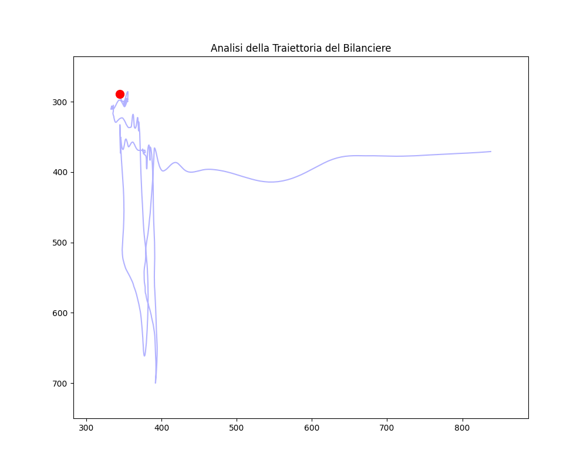
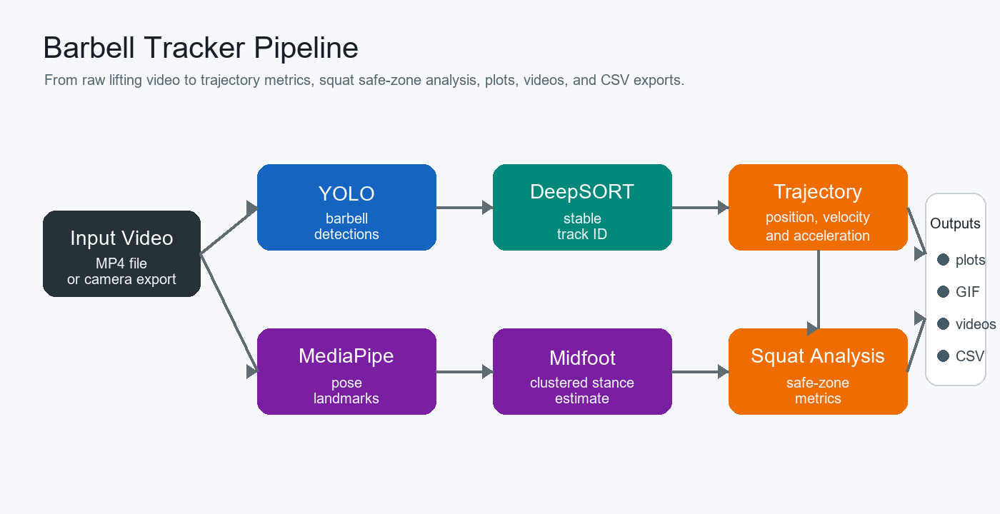
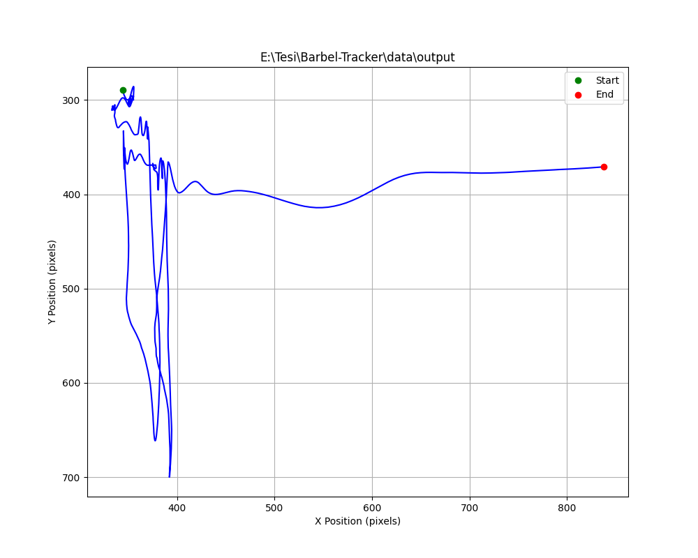
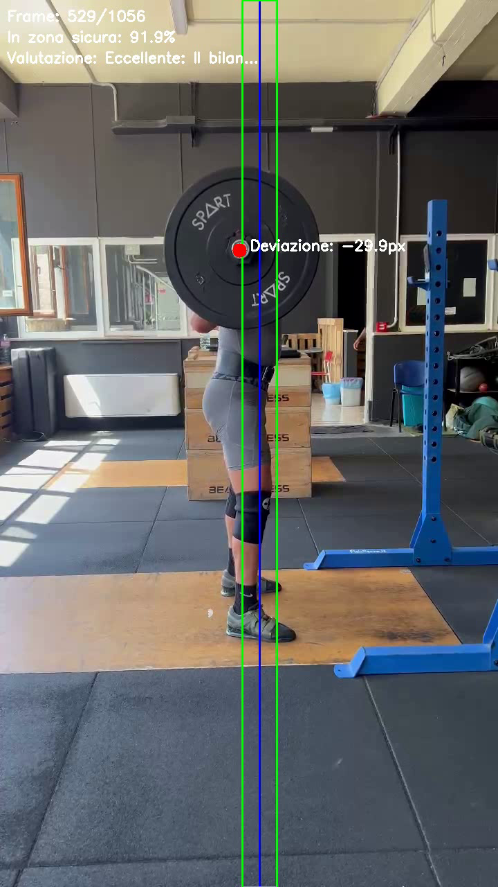

# Barbell Tracker

Python pipeline for tracking barbell trajectory and analyzing squat execution from video.

[](https://github.com/scoseca/Barbel-Tracker/actions/workflows/tests.yml)

## Demo



## Overview

Barbell Tracker combines object detection, multi-object tracking, pose estimation, trajectory analysis, and visualization in a single configurable pipeline.

The pipeline uses a trained YOLO model to detect the barbell, DeepSORT to keep a stable track across frames, and MediaPipe pose landmarks to estimate the lifter's midfoot position. The final output is a set of plots, videos, GIF animations, CSV files, and summary metrics that describe the bar path during the lift.

## Features

- Detect and track the barbell across a video.
- Select the longest tracked trajectory as the main bar path.
- Smooth the trajectory and compute displacement, velocity, acceleration, and path length.
- Estimate the midfoot position with MediaPipe pose landmarks.
- Compare the barbell path against the midfoot safe zone during squat analysis.
- Generate plots, annotated videos, animations, and CSV exports.
- Run the complete workflow from a YAML config file or CLI overrides.

## Pipeline



Main stages:

- YOLO detects the barbell in each frame.
- DeepSORT assigns and maintains track IDs.
- The trajectory analyzer selects and smooths the main bar path.
- MediaPipe estimates pose landmarks.
- Foot clustering estimates a stable midfoot reference.
- Squat analysis compares the bar path with the configured safe zone.
- Visualization and export modules write plots, videos, GIFs, and CSV files.

## Example Results

The repository includes lightweight visual examples under `assets/` so the expected outputs are visible without committing full videos, datasets, model weights, or training runs.

| Trajectory plot | Squat analysis frame |
| --- | --- |
|  |  |

With the example config, generated files are written under `outputs/demo/`:

```text
outputs/demo/
+-- barbell_position.png
+-- barbell_trajectory_animation.gif
+-- trajectory_video.mp4
+-- squat_analysis.mp4
+-- foot_position_clusters.png
+-- csv/
    +-- position_data.csv
    +-- velocity_data.csv
    +-- acceleration_data.csv
    +-- summary_stats.csv
```

The pipeline extracts:

- horizontal displacement from the estimated midfoot position;
- vertical barbell displacement;
- velocity and acceleration curves;
- total path length;
- percentage of frames inside the safe zone;
- trajectory visualization over the original video.

Example summary:

```text
valid trajectory points: 142
selected track ID: 3
estimated FPS: 30
average horizontal deviation: 24.6 px
max horizontal deviation: 71.3 px
time inside safe zone: 82.4%
```

Pixel-based distances depend on video resolution and camera framing, so compare them across videos only when the camera setup is consistent.

## Installation

Using Anaconda is recommended:

```powershell
conda create -n barbell-tracker python=3.10
conda activate barbell-tracker
pip install -r requirements.txt
```

If you already have an exported conda environment file, you can use it instead:

```powershell
conda env create -f path\to\environment.yaml
conda activate barbell-tracker
```

Create these local folders manually:

```text
models/
+-- mediapipe/
|   +-- pose_landmarker_heavy.task
+-- yolo/
    +-- barbell/
        +-- best.pt

sample_data/
+-- short-demo.mp4
```

Recommended paths match `configs/pipeline.example.yaml`:

- `models/yolo/barbell/best.pt`: trained YOLO barbell detector.
- `models/mediapipe/pose_landmarker_heavy.task`: MediaPipe Pose Landmarker model.
- `sample_data/short-demo.mp4`: short local test video.

Do not commit model weights, raw datasets, generated runs, or long videos.

## Usage

Copy the example config and edit paths for your machine:

```powershell
Copy-Item configs\pipeline.example.yaml configs\pipeline.yaml
```

Run the pipeline from the project root:

```powershell
py -3 main.py --config configs\pipeline.yaml
```

You can override key config values from the CLI:

```powershell
py -3 main.py `
  --config configs\pipeline.yaml `
  --input sample_data\short-demo.mp4 `
  --yolo_model_path models\yolo\barbell\best.pt `
  --pose_landmarker_path models\mediapipe\pose_landmarker_heavy.task `
  --device cuda `
  --confidence 0.5
```

Important config fields:

- `paths.input_video`: input video.
- `paths.output_dir`: base output directory.
- `models.yolo_model_path`: YOLO `.pt` weights.
- `models.pose_landmarker_path`: MediaPipe `.task` file.
- `runtime.device`: `cuda` or `cpu`.
- `runtime.confidence`: detection threshold.
- `analysis.squat.safe_zone_px`: allowed horizontal deviation from midfoot.
- `foot_detection.n_clusters`: KMeans clusters for stable foot position.

## Project Structure

```text
barbell-tracker/
+-- assets/
|   +-- demo.gif
|   +-- trajectory-example.png
|   +-- squat-analysis-frame.png
|   +-- pipeline-overview.png
+-- configs/
|   +-- pipeline.example.yaml
+-- src/
|   +-- barbell_tracker/
|   |   +-- cli.py
|   |   +-- config.py
|   |   +-- pipeline.py
|   |   +-- analysis/
|   |   +-- tracking/
|   |   +-- pose/
|   |   +-- visualization/
|   |   +-- export/
|   |   +-- utils/
|   +-- detection/
|       +-- legacy training and validation scripts
+-- tests/
+-- main.py
+-- requirements.txt
+-- README.md
```

Local-only folders such as `models/`, `outputs/`, `runs/`, large datasets, and raw videos are ignored by git.

## Tests

Run the current unit tests with:

```powershell
py -3 -m unittest discover -s tests
```

The tests use synthetic data and do not require YOLO weights, MediaPipe models, or a GPU.

## Limitations

- Metrics are pixel-based unless a camera calibration step is added.
- Results depend on camera position, video quality, and barbell visibility.
- The YOLO detector must be trained or fine-tuned for the target video domain.
- MediaPipe foot landmarks can be unreliable when the lifter is occluded.
- The CI badge assumes a GitHub Actions workflow at `.github/workflows/tests.yml`.
